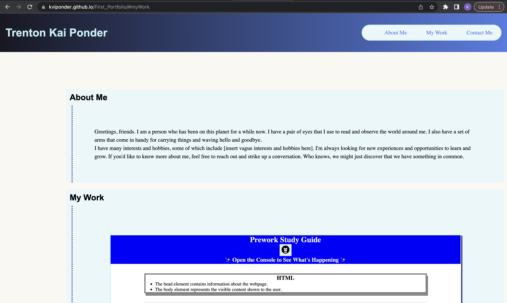
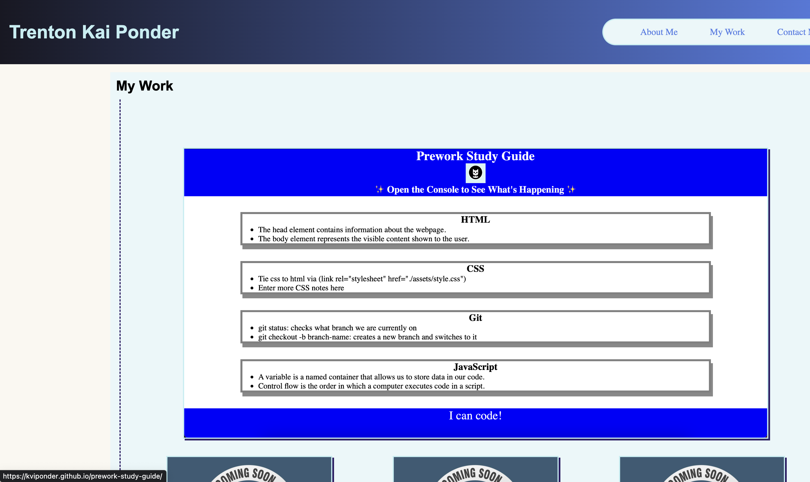
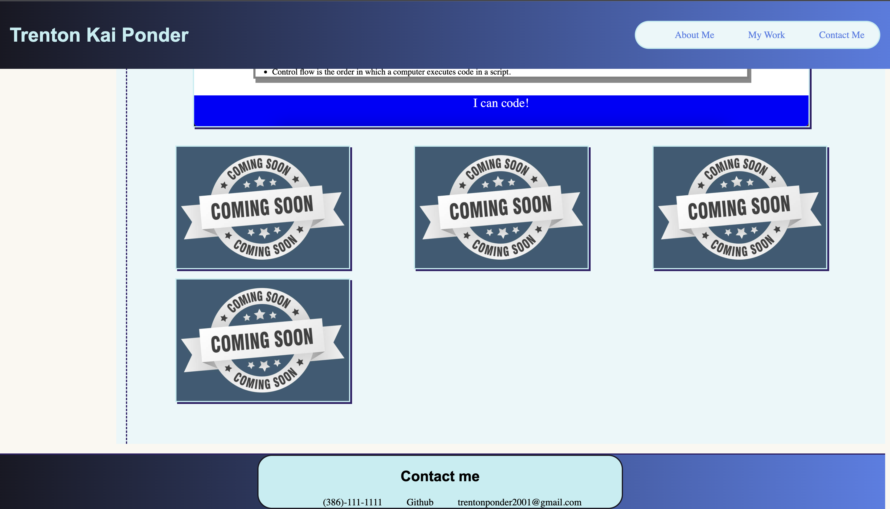

# FirstPortfolio

A portfolio page with various CSS elements focusing on working nav links, structure, and functionality across different media, ie: phones, tablets, and computers
Functionality of the Webpage

"ponderThis" is a personal website that serves as an online portfolio and contact platform for Trenton Kai Ponder. The website's main goal is to showcase Trenton's skills and work, making it easy for potential clients or collaborators to view his previous projects and contact him for potential opportunities.

The webpage is designed to meet the following criteria:

GIVEN I need to sample a potential employee's previous work
WHEN I load their portfolio
THEN I am presented with the developer's name, a recent photo or avatar, and links to sections about them, their work, and how to contact them.

The header of the webpage is positioned at the top and contains the website owner's name, Trenton Kai Ponder, and a navigation menu. The navigation menu contains three links that take the user to different sections of the webpage, including "About Me," "My Work," and "Contact Me." The header remains fixed, so it stays at the top of the screen even as the user scrolls through the content.

WHEN I click one of the links in the navigation
THEN the UI scrolls to the corresponding section.

The navigation menu links are interactive and take the user to the corresponding section of the webpage. The UI scrolls smoothly to the desired section, making it easy for the user to navigate the webpage.

WHEN I click on the link to the section about their work
THEN the UI scrolls to a section with titled images of the developer's applications.

The "My Work" section showcases Trenton's previous and upcoming projects with five placeholder images. When the user clicks on the link to the section about Trenton's work, the UI scrolls to a section that displays titled images of Trenton's applications. The images are designed to be interactive, so when the user clicks on them, they are taken to the deployed application.

WHEN I am presented with the developer's first application
THEN that application's image should be larger in size than the others.

Trenton's first application is showcased as the largest image to make it stand out from the rest of his work. The other images are slightly smaller but are designed to be equally visible to the user.

WHEN I click on the images of the applications
THEN I am taken to that deployed application.

The images of Trenton's applications are interactive and allow the user to click on them to view the deployed application.

WHEN I resize the page or view the site on various screens and devices
THEN I am presented with a responsive layout that adapts to my viewport.

The webpage is designed to be responsive and adaptable to different screens and devices. Whether the user views the site on a desktop or mobile device, the webpage adjusts accordingly, providing an optimal viewing experience.

### CSS Styling
The webpage is styled using CSS, providing a modern and visually appealing aesthetic. The CSS defines a color scheme with various shades of blue, sets font styles for different headings, and provides formatting for various elements on the page. The header is designed with a linear gradient that transitions from black to blue, providing a subtle yet striking effect. The CSS also includes some interactive functionality, such as hover effects on navigation links, making the webpage feel more dynamic and engaging.

Overall, "ponderThis" serves as a simple yet effective online portfolio for Trenton Kai Ponder. It showcases Trenton's skills, work, and interests while providing contact information for potential clients or collaborators to get in touch with him. The webpage meets the criteria for a potential employee's previous work by providing a clear and concise overview of Trenton's work and making it easy for the user to navigate the webpage.

## Link to Webpage
### https://kviponder.github.io/First_Portfolio/#myWork
## Screenshots

